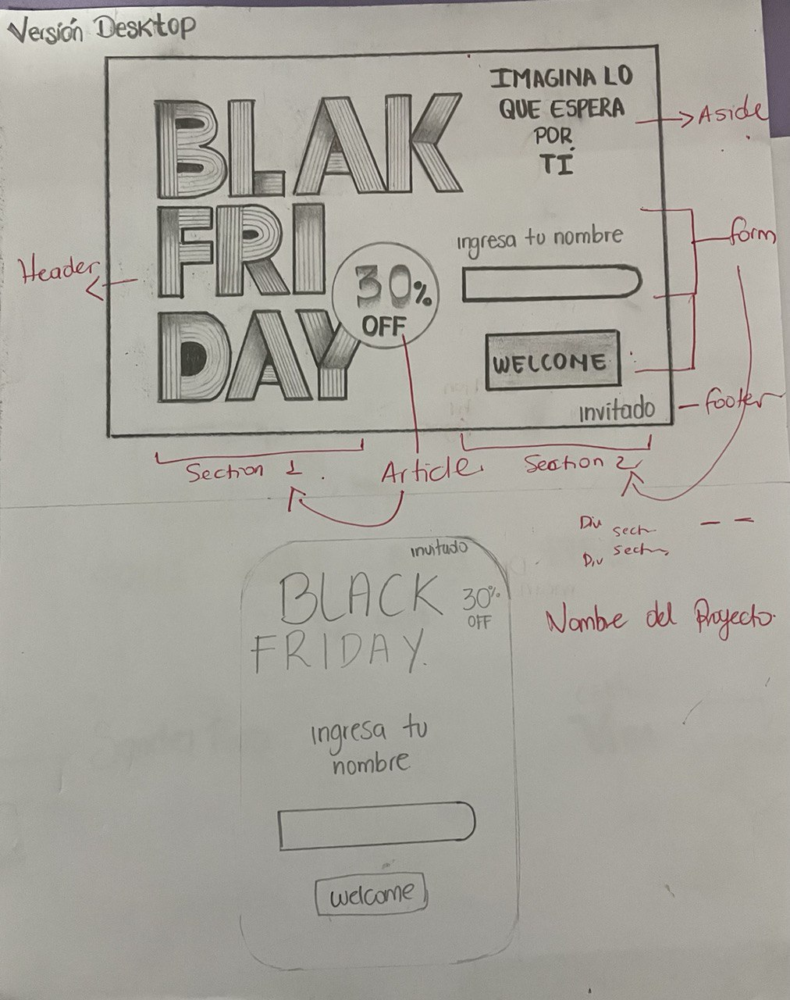
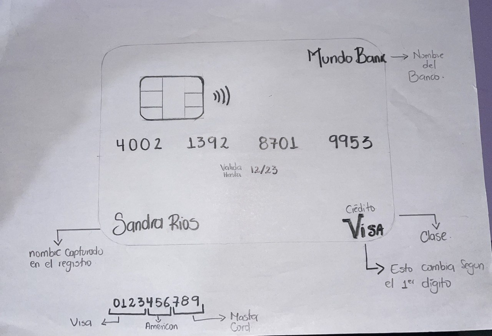
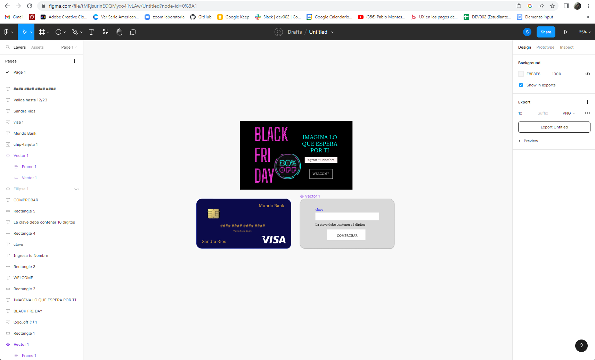
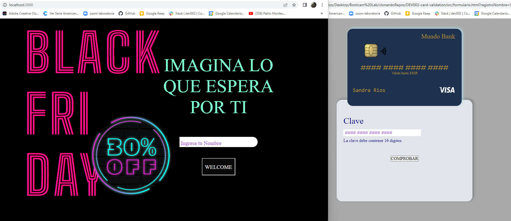

# COOL STORE

## seguridad y confianza

Mi proyecto se trata sobre la creación de una pagina de fácil acceso en donde el usuario sienta la plena confianza de realizar la compra finaL sin necesidad de llenar un formulario tedioso.

## prototipos de baja fidelidad

## prototipo de alta fidelidad

Aquí se realizó el prototipo en Figma Design pensando principalmente en la experiencia de ususario.

## principales usuarios del producto

los usuarios que accedan a ésta aplicación son todos aquellos que necesiten comprar algo y que se encuentra en descuento, y que tienen la oportunidad una vez al año de conseguirlo con ese precio.

## ¿Que me llevó a definir este producto?

Este proyecto esta basado en la experiencia de usuario ya que la UX es un conjunto de sensaciones y percepciones que producen en el usuario los distintos elementos que intervienen cuando interactúa con un producto, servicio, web, etc.
* la aplicación le da la facilidad a los usuarios de acceder a la compra sin necesidad de registrarse por medio de un formulario.
* Ya habiendo ingresado el usuario al momento del pago ingresa su clave con un formulario sencillo y los digitos se encuentran reemplazados por un numeral.

* en cuanto a la **validación de Luhn** el 53% de las tiendas online no utilizan la validación, y esto es una falla ya que Puede que se cometan errores al escribir la cadena de número de tarjeta de crédito de 15 a 16 dígitos y para solucionar esto la validación de Luhn verifica mediante un algoritmo si el número de tarjeta ingresado por un usuario es correcto.

## RESUMEN DE FEEDBACK

## IMAGEN DEL PROYECTO FINAL

