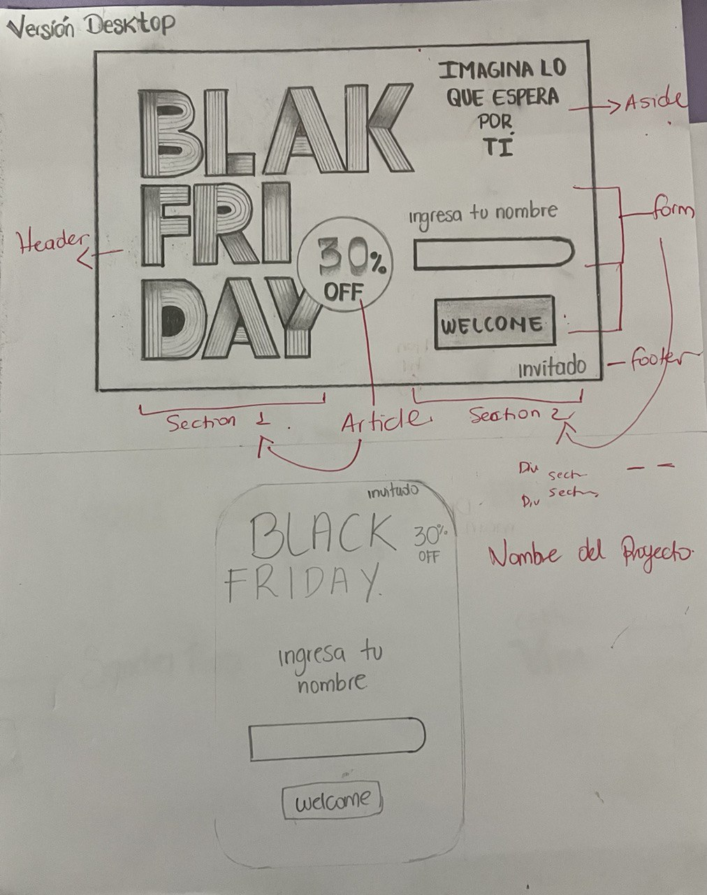
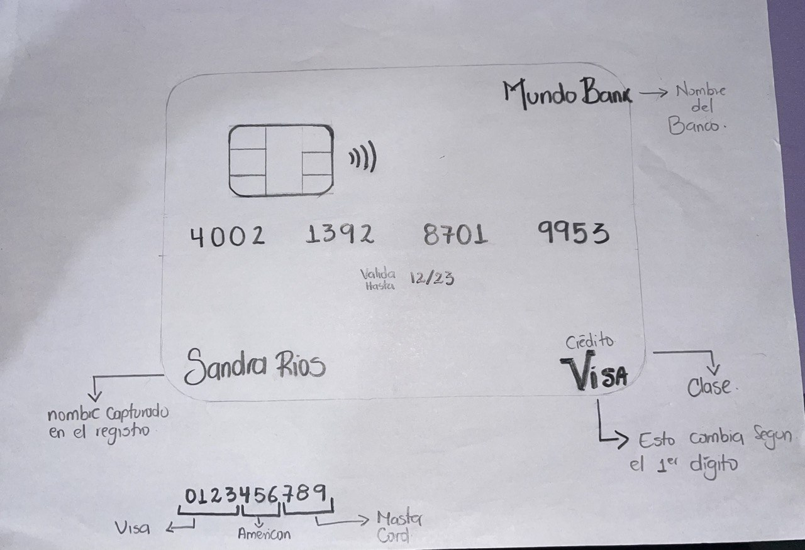

# COOL STORE

## seguridad y confianza

Mi proyecto se trata sobre la creación de una pagina de fácil acceso en donde el usuario sienta la plena confian de registrase y realizar la compra finaL.

* los usuarios que accedan a ésta aplicación son todos aquellos que necesiten comprar algo y que se encuentra en descuento, y que tienen la oportunidad una vez al año de conseguirlo con ese precio.
este proyecto esta basado en la experiencia de usuarios ya que la UX es un conjunto de sensaciones y percepciones que producen en el usuario los distintos elementos que intervienen cuando interactúa con un producto, servicio, web, etc.
* en cuanto a la **validación de Luhn** el 53% de las tiendas online no utilizan la validación, y esto es una falla ya que Puede que se cometan errores al escribir la cadena de número de tarjeta de crédito de 15 a 16 dígitos y para solucionar esto la validación de Luhn verifica mediante un algoritmo si el número de tarjeta ingresado por un usuario es correcto.